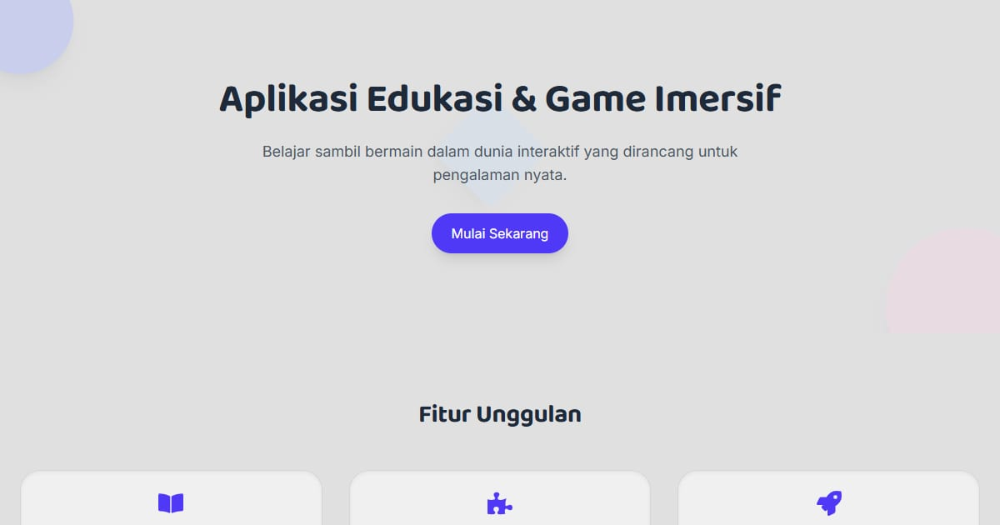

# EduPlay — Belajar Sambil Bermain

EduPlay: aplikasi edukasi & game imersif. Belajar jadi seru lewat dunia interaktif yang dirancang untuk pengalaman nyata.

**Demo live:** https://landing-eduplay.vercel.app



> Template landing page untuk bisnis fiktif. Formulir di dalamnya hanya demo dan tidak mengirim data.

## Konsep

Bahasa rupa **Neumorfis**: seluruh bidang berdiri di atas satu warna dasar, dan kedalaman datang dari sepasang bayangan terang dan gelap.

## Halaman

`/`

## Teknologi

- Next.js 15.5 (App Router) dan React 19
- Tailwind CSS v4
- JavaScript
- Framer Motion, React Icons
- Font: Baloo 2, Inter (next/font)
- SEO: metadata per halaman, Open Graph, JSON-LD, sitemap.xml, dan robots.txt

## Menjalankan secara lokal

```bash
npm install
npm run dev
```

Buka http://localhost:3000. Untuk build produksi: `npm run build` lalu `npm start`.

---

Bagian dari koleksi 17 template landing page di [PortalLanding](https://portal-landing-seven.vercel.app). Dibuat oleh [PintuWeb](https://pintuweb.com), jasa pembuatan website.
